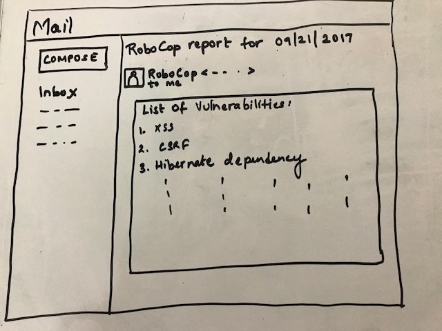
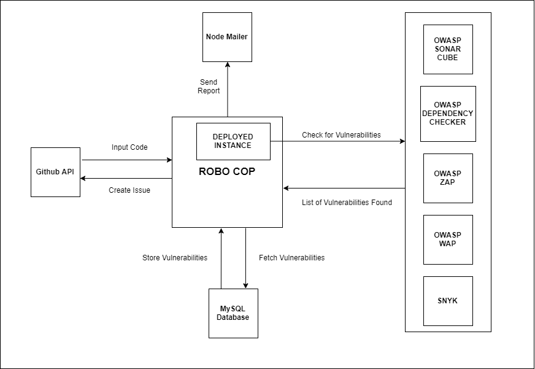

# DESIGN
#### Problem Statement:
Data is prime commodity for any corporate. While developing an application it is responsibility of the developers to allow restricted access to data and follow proper security protocols. For example, an offshoot of Anonymous, hacktivist group Lulzsec in June 2011 hacked into Sony Pictures via SQL Injection attack and stole data that included names, passwords, e-mail and home addresses of thousands of customers. The group claimed to have compromised over one million accounts.

> >“As the world is increasingly interconnected, everyone shares the responsibility of securing cyberspace.”  
> > Newton Lee, Counterterrorism and Cybersecurity: Total Information Awareness

As the world gets online, hackers have more and more incentives to breach the security of applications on the web and obtain valuable information. Recent hacking of Equifax only goes to show that not even the biggest companies are completely secure. However, it is not the companies that are the worst hit by these hacks. The users of their products, whose details are leaked, are the ones hardest hit. As more and more personal services go online, it is imperative to secure them properly. Leak of Personal Identifiable Information is the biggest threat to consumers of these applications as it can have consequences that may not be immediately visible.

The main cause of services not being secure enough is the fact that most developers are not thinking about security when they are building these applications. This means that applications are often vulnerable to some of the oldest and easiest attacks. Things like sql-injection, cross-site scripting and CSRF attacks have been known about for quite some time now and many effective mitigation strategies have been developed to counter these attacks. However, we are seeing more and more of these attacks. Hence there is an urgent need to automatically detect if there are vulnerabilities in the code, and to correct them as soon as possible.

There are several static analysis tools and fuzzing tools to test the security of an application, however, they require the developer to be constantly running them in his workstation and keep checking for their result. We feel that an automated bot can ease this process, so that the developers can concentrate on writing code. The bot we imagine will create ‘issues’ on github repos, comment on specific lines of code which introduce a vulnerability and assign these to the developer who wrote the code.

#### Bot Description:
We aim at developing a drone bot that responds to different git operations when applied to a git repository. For example, when a collaborator commits to a git repo, then it will scan the code using OWASP ZAP API’s and static source analyzers to find the components of User Interface or a module that can be compromised for a security attack.

ZAP API works by actually running the web application in a browser. It attempts penetration testing on different web pages and identifies the network attacks to which a page is prone to. WAP is another tool to detect and correct input validation vulnerabilities in web applications written in PHP and predicts false positives. The tool combines source code static analysis and data mining to detect vulnerabilities and predict false positives. It then corrects the source code to remove the vulnerabilities inserting fixes(small functions) in the right places of the source code.

Our bot application will be using these tools to scan the changes in the code for vulnerabilities and possible network attacks to raise issues if any such vulnerability is found and can raise comments on appropriate locations, for example, on commits applied to a repository. The application can be integrated to any github repository and it can also be invoked with git pull request and commit operation.

#### Use Cases:

Our bot will aid users while performing the following tasks:

1. Check security vulnerabilities of an application when bot is integrated with the repo for the first time
    1. __Preconditions__  
    The repo must have the security bot installed.
    2. __Main Flow__  
     Github signals the bot to check the code present in the repository against any potential vulnerabilities. Bot fetches the code from the repository and runs OWASP ZAP and static analysis tools [S1]. Bot will collect the list of vulnerabilities and raise an issue with the vulnerabilities found [S2].
    3. __Subflows__  
    [S1] - The tools will be picked according to the programming language or framework used.
    [S2] - The issue will be raised with title as <type_of_vulnerability>.
    4. __Alternative Flows__  
    If no vulnerabilities are found, the bot comments that no vulnerability is detected in the code.

2. A developer wants to see all the vulnerabilities introduced in the code because of his commit
    1. __Preconditions__  
     The repo must have the security bot installed.
    2. __Main Flow__  
     One of the developers commits a piece of code. Github signals the bot with the commit id. Bot fetches the code from the commit and runs OWASP ZAP and static analysis tools [S1]. Bot will collect the list of vulnerabilities and post a comment on the commit with the new vulnerabilities found because of it. It also raises an issue with the vulnerabilities found [S2].
    3. __Subflows__  
     [S1] - The tools will be picked according to the programming language or framework used.
     [S2] - The issue will be raised with title as <type_of_vulnerability>.
    4. __Alternative Flows__  
     If no vulnerabilities are found, the bot comments that no vulnerability is detected in the code.

3. A repo collaborator has to check a pull request for vulnerabilities.
      1. __Preconditions__  
       The repo must have the security bot installed.
      2. __Main Flow__  
       Some contributor raises a pull request [S1]. Github signals the bot with the pull request number. Bot fetches the code from the Pull Request and runs OWASP ZAP and static analysis tools. Bot makes comments on the Pull Request, detailing the new vulnerabilities added because of it.
      3. __Subflows__  
       [S1] - The contributor can raise a pull request from another fork, or from one of the branches in the same repo. The bot will analyze both the base and the branch to be merged, and report any differences.
      4. __Alternative Flows__  
       If no vulnerabilities are found, the bot comments that no vulnerability is detected in the code.

4. Get vulnerability report of the day via email
    1. __Preconditions__  
      The repo must have the security bot installed.
    2. __Main Flow__  
      Bot will query the database and fetch list of vulnerabilities from past 5 commits. It sends out an email stating the vulnerabilities found.
    3. __Alternative Flows__  
      If no vulnerabilities are found, the bot sends an email that no vulnerability is detected in the code.

#### Wireframes

Robocop will work as a service in github, and have the following screens :

##### Integration -
  
The idea here is to show how a potential owner can add Robocop to his repo. He can go to settings and to services and integration tab, and search for Robocop. He just adds Robocop as a service, and Robocop starts doing its magic.

##### Issues Raised -
  
After Robocop is added to a repo, it will raise issues for the vulnerabilities it finds in the application.

##### Commits pushed -
  
When a user pushes a commit, robocop will make comments if there are any new security vulnerabilities created because of that commit.

##### Pull request created -
  
Someone creates a pull request. This can be from the same repo of from a fork of this repo. Robocop will analyse the pull request and make comments about the security vulnerabilities introduced in this pull request.

##### Report Email -

The bot can also send timely vulnerability report to the owner or the security team so that they may act on these quickly.

#### Storyboards

Some storyboards describing primary tasks of our bot:

##### Scenario 1 -

A developer tries to use RoboCop to test his application against any security vulnerability as he builds it. He adds the service to his GitHub repository and starts development and make a commit. The commit triggers RoboCop to check the code/application and report any vulnerability found in the form of comments and issues.

##### Scenario 2 -

Some developer wants to add a feature to an application utilizing RoboCop. He creates a pull request which triggers RoboCop to check for any security vulnerability present in the code. RoboCop comments on the pull request with list of vulnerabilities found.

#### Architecture Design
Before looking at the architecture, we wanted to figure out the different components of Robocop.

The first distinction is that the actual repository lives on github, while Robocop will run on some machine. So these two will be two separate components.  

Also, we use plan to use 3 types of security analysis tools.  
1. Attack based tools like OWASP ZAP.
2. Static code analysis tools like OWASP WAP and Bandit.
3. Dependency checkers like Snyk and OWASP Dependency check.

Since these tools go through either the actual code or a deployed instance of the application, Robocop will need a git clone and a deployed instance of that application. This will be another part of the application.

Also, Robocop will need some database to store the vulnerabilities it finds, to make sure they are not reported again.

With that, we made the following overall architecture.

  

So Robocop acts as an interface between github repo, and the various security tools, and makes the decisions on which tools to call and what to do with the output. It checks the vulnerabilities it finds in the database, whether they have been reported before or not. If they are new vulnerabilities, they are reported to github in the appropriate format.

