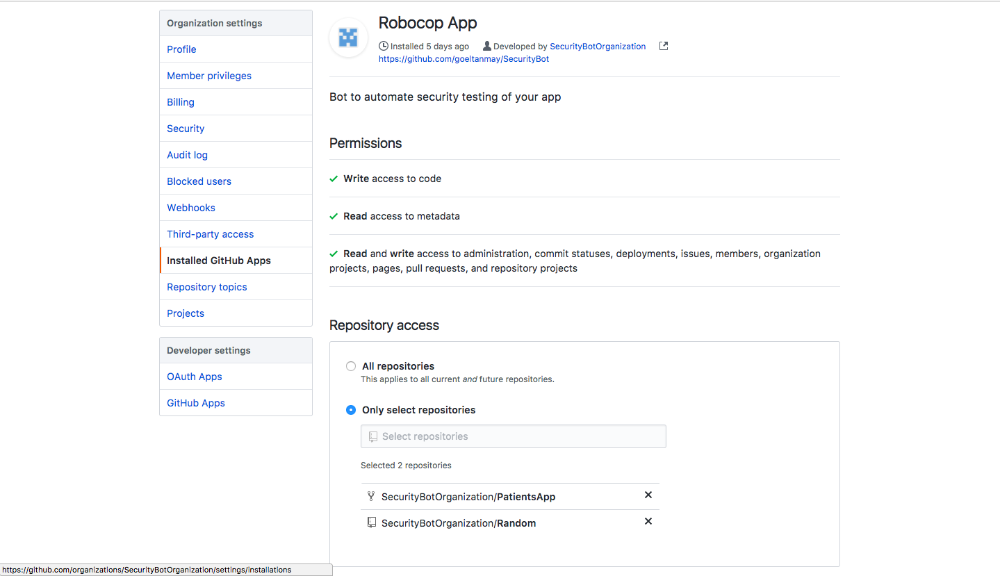
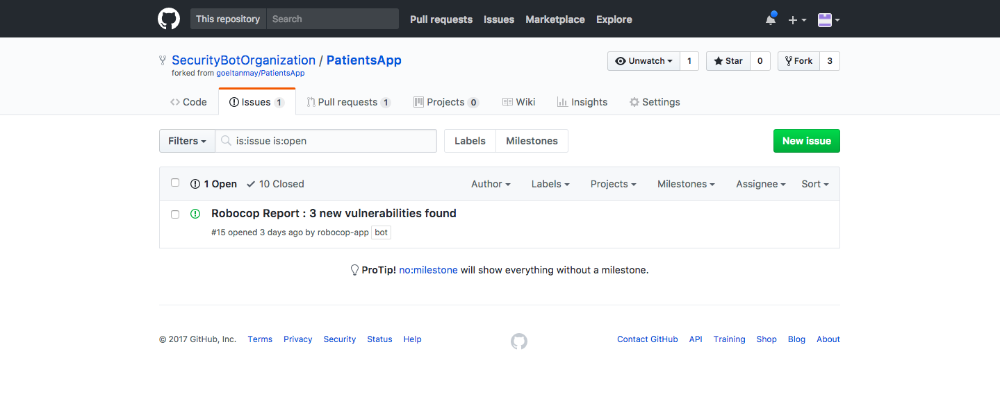
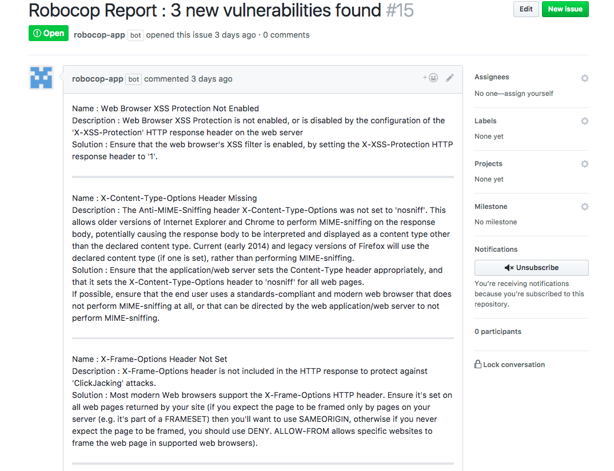
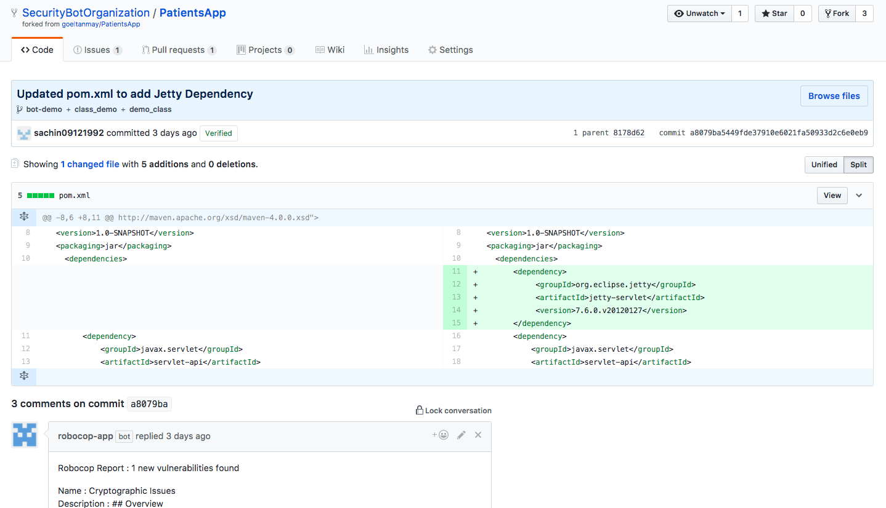
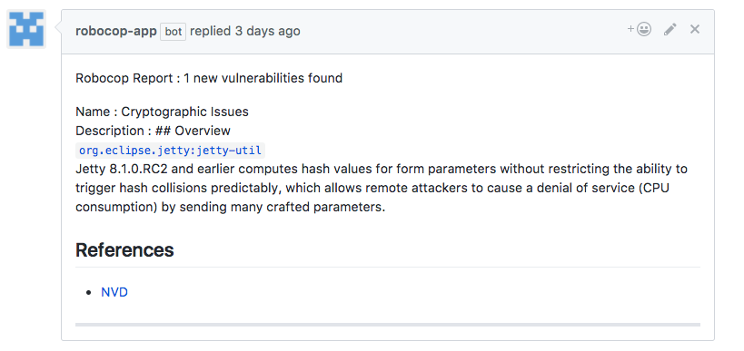
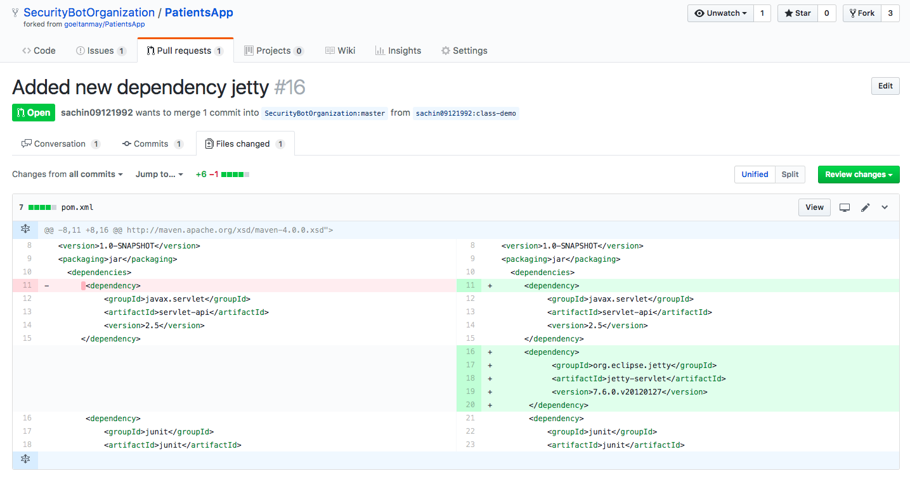

## Final Report

### Problem Statement
Data is prime commodity for any corporate. While developing an application it is responsibility of the developers to allow restricted access to data and follow proper security protocols. For example, an offshoot of Anonymous, hacktivist group Lulzsec in June 2011 hacked into Sony Pictures via SQL Injection attack and stole data that included names, passwords, e-mail and home addresses of thousands of customers. The group claimed to have compromised over one million accounts.

> >“As the world is increasingly interconnected, everyone shares the responsibility of securing cyberspace.”  
> > Newton Lee, Counterterrorism and Cybersecurity: Total Information Awareness

As the world gets online, hackers have more and more incentives to breach the security of applications on the web and obtain valuable information. Recent hacking of Equifax only goes to show that not even the biggest companies are completely secure. However, it is not the companies that are the worst hit by these hacks. The users of their products, whose details are leaked, are the ones hardest hit. As more and more personal services go online, it is imperative to secure them properly. Leak of Personal Identifiable Information is the biggest threat to consumers of these applications as it can have consequences that may not be immediately visible.

The main cause of services not being secure enough is the fact that most developers are not thinking about security when they are building these applications. This means that applications are often vulnerable to some of the oldest and easiest attacks. Things like sql-injection, cross-site scripting and CSRF attacks have been known about for quite some time now and many effective mitigation strategies have been developed to counter these attacks. However, we are seeing more and more of these attacks. Hence there is an urgent need to automatically detect if there are vulnerabilities in the code, and to correct them as soon as possible.

There are several static analysis tools and fuzzing tools to test the security of an application, however, they require the developer to be constantly running them in his workstation and keep checking for their result. We feel that an automated bot can ease this process, so that the developers can concentrate on writing code. The bot we imagine will create ‘issues’ on github repos, comment on specific lines of code which introduce a vulnerability and assign these to the developer who wrote the code.

### Use Cases

Our bot will aid users while performing the following tasks:

1. Check security vulnerabilities of an application when bot is integrated with the repo for the first time
    1. __Preconditions__  
    The repo must not have the security bot installed.
    2. __Main Flow__  
     Github signals the bot to check the code present in the repository against any potential vulnerabilities. Bot fetches the code from the repository and runs OWASP ZAP and static analysis tools [S1]. Bot will collect the list of vulnerabilities and raise an issue with the vulnerabilities found [S2].
    3. __Subflows__  
    [S1] - The tools will be picked according to the programming language or framework used.
    [S2] - The issue will be raised with title as <type_of_vulnerability>.
    4. __Alternative Flows__  
    If no vulnerabilities are found, the bot comments that no vulnerability is detected in the code.

    

    

    

2. A developer wants to see all the vulnerabilities introduced in the code because of his commit
    1. __Preconditions__  
     The repo must have the security bot installed.
    2. __Main Flow__  
     One of the developers commits a piece of code. Github signals the bot with the commit id. Bot fetches the code from the commit and runs OWASP ZAP and static analysis tools [S1]. Bot will collect the list of vulnerabilities and post a comment on the commit with the new vulnerabilities found because of it. It also raises an issue with the vulnerabilities found [S2].
    3. __Subflows__  
     [S1] - The tools will be picked according to the programming language or framework used.
     [S2] - The issue will be raised with title as <type_of_vulnerability>.
    4. __Alternative Flows__  
     If no vulnerabilities are found, the bot comments that no vulnerability is detected in the code.

     

     

3. A repo collaborator has to check a pull request for vulnerabilities.
      1. __Preconditions__  
       The repo must have the security bot installed.
      2. __Main Flow__  
       Some contributor raises a pull request [S1]. Github signals the bot with the pull request number. Bot fetches the code from the Pull Request and runs OWASP ZAP and static analysis tools. Bot makes comments on the Pull Request, detailing the new vulnerabilities added because of it.
      3. __Subflows__  
       [S1] - The contributor can raise a pull request from another fork, or from one of the branches in the same repo. The bot will analyze both the base and the branch to be merged, and report any differences.
      4. __Alternative Flows__  
       If no vulnerabilities are found, the bot comments that no vulnerability is detected in the code.

       

       

       

4. Get recent vulnerability report via email
    1. __Preconditions__  
      The repo must have the security bot installed.
    2. __Main Flow__  
      Bot will query the database and fetch list of vulnerabilities from past 5 commits. It sends out an email stating the vulnerabilities found.
    3. __Alternative Flows__  
      If no vulnerabilities are found, the bot sends an email that no vulnerability is detected in the code.

      

      

### Project and Development Process

We were really excited as we believed we are solving a real problem. We looked up the github app store and found that there were only 2 applications related to security, and both of them were just dependency checkers so there was definitely a space for a more comprehensive security application.

We are really excited as we believed we are solving a real problem. Most of the development work was done during the BOT milestone. The way github apps work is that there needs to be one server where github pushes the events, so we had to split our original design of one bot into 2. One was the server which communicated with github and had all the github related logic, and the local instance, which ran the different security tools and reported the results to the server.

Most of the development work was done during the BOT milestone. The way github apps work is that there needs to be one server where github pushes the events, so we had to split our original design of one bot into 2. One was the server which communicated with github and had all the github related logic, and the local instance, which ran the different security tools and reported the results to the server.

We divided ourselves into 2 teams of 2 people. Tanmay and Palak worked on the server while Jitin and Sachin worked on the local instance. We practiced pair programming, and had everyday standups during the BOT milestone, so that all the development happened in sync and both the teams were not waiting on the other.

Most of the technical hurdles were solved within the BOT milestone, and the first version was delivered. In this version, the services on the local instance were mocked, but the structure of the mocked calls was the same as actual service calls which meant that in the service milestone, we just had to switch off mocking to make our code work.

### Limitations and Future Work
